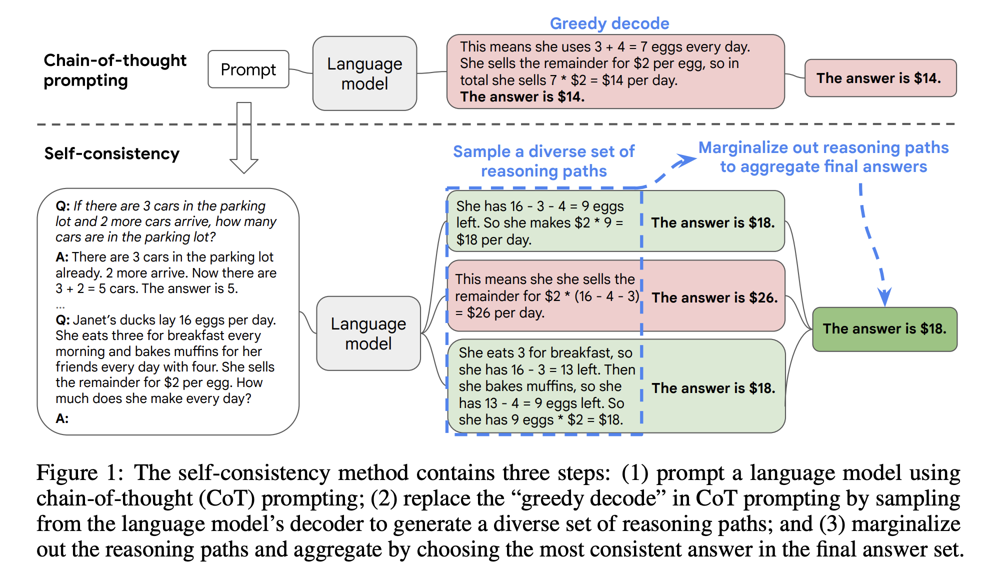

# Concurrent LM Calls

Many prompt engineering techniques like [Self-Consistency (CoT-SC)](https://arxiv.org/abs/2203.11171) and [Tree of Thoughts (ToT)](https://arxiv.org/abs/2305.10601) involve non-sequential LM calls such as branching and gathering, where parallelizing the calls can significantly speed up the process.

APPL provides a simple way to parallelize these calls using [asynchronous computation](https://docs.python.org/3/library/concurrent.futures.html).

## Asynchronous Execution
In APPL, the `gen` function automatically starts a new thread (or process) to handle the LM call. The `gen` function does not block the main thread and returns a `Generation` object that represents the generation result. The generation result is not synchronized (waited) until its value is needed, therefore, multiple independent `gen` calls can be executed concurrently.

!!! info "StringFuture to represent strings that may not be available yet"
    To support asynchronized execution, we introduce the `StringFuture` object similar to [`concurrent.futures.Future`](https://docs.python.org/3/library/concurrent.futures.html#future-objects). `StringFuture` is a placeholder for a string value that will be available in the future, and can be used to represent generation results that are computed in other threads and not yet available.

    In most scenarios, you can use `StringFuture` as a normal `str`. The `StringFuture` delays its synchronization when possible, ideally only synchronizes the value when the `str` is called. For example, a concatenation of `StringFuture` objects can be done without waiting for the value of each `StringFuture` to be available.

```python linenums="1"
import time

import appl
from appl import gen, ppl, StringFuture

@ppl
def mul(x:int, y:int):
    f"3*4=12"
    f"{x}*{y}="
    return gen()

t0 = time.time()
n = 3
s = StringFuture("\n").join(
    StringFuture(" ").join(mul(i + 1, j + 1) for j in range(n))
    for i in range(n)
) # (1)
print(f"Time: {time.time() - t0:.2f}")
print(s)
print(f"Time: {time.time() - t0:.2f}")
```

1. equivalent to
```python
s = ""
for i in range(n):
    if i:
        s += "\n"
    for j in range(n):
        if j:
            s += " "
        s += mul(i + 1, j + 1)
```

In this example, several `Generation` objects are returned by the `mul` function, and the `StringFuture` objects are used to concatenate the results, which results in a `StringFuture` object without synchronizing the generation results. The `print` function requires the value of the `StringFuture` object `s`, which triggers the synchronization of the generation results. Since the threads are already started when the `gen` function is called, the generation results are computed in parallel.

Output will looks like:
```plain
Time: 0.09
1 2 3
2 4 6
3 6 9
Time: 1.91
```
where starting new threads could have a small overhead, but relatively small than API calls.

!!! note "Force synchronization"
    If you want to force synchronization, you can call `.results` to wait for the results, or simply use `str` directly if the result is a string. For example, `mul(3, 4).results` or `str(mul(3, 4))`.

    This could lead to a slower execution time, for example, if you replace the computation of `s` as `s = "\n".join(" ".join(str(mul(i + 1, j + 1)) for j in range(n)) for i in range(n))`, the runtime could be around 8 seconds since the generations are not parallelized.

## Example (CoT-SC)

The following example demonstrates how to use APPL to naturally exploit the independence among the reasoning paths in [Self Consistency of Chain-of-Thoughts](https://arxiv.org/abs/2203.11171) to parallelize the execution.

??? info "Self Consistency of Chain-of-Thoughts (CoT-SC)"
    * [**Chain-of-thoughts (CoT) prompting**](https://arxiv.org/abs/2201.11903) enhances the LLM's ability to perform complex reasoning by providing examples of intermediate reasoning steps.
    * **Self consistency** samples different reasoning pathes from the LLM then marginalizes to generate a consensus. 

    Below is an illustration of this method from the paper "Self-Consistency Improves Chain of Thought Reasoning in Language Models"[^1].

    [^1]: https://arxiv.org/abs/2203.11171

    {: style="width:600px"}

The implementation below shows an example of determining if a set of numbers add up to an even number (task introduced in [source](https://www.promptingguide.ai/techniques/cot)).

```python linenums="1" hl_lines="30 38"
--8<-- "examples/basic/cot_sc.py"
```

Output will looks like:

```
Parallel CoT-SC Answer: False
Parallel CoT-SC takes 1.74 seconds
Sequential CoT-SC Answer: False
Sequential CoT-SC takes 7.42 seconds
```
