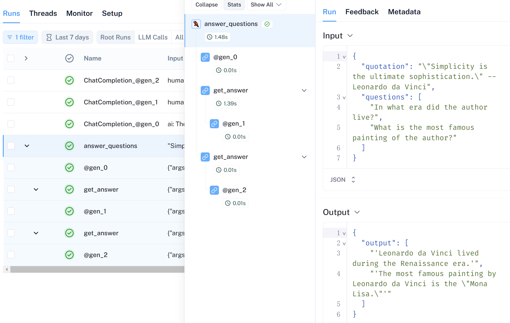

# Using Tracing

APPL supports tracing APPL functions and LM calls to facilitate users to understand and debug the program executions. The trace is useful for reproducing (potentially partial) execution results by loading cached responses of the LM calls, which enables failure recovery and avoids the extra costs of resending these calls. This also unlocks the possibility of debugging one LM call conveniently.

## Enabling APPL Tracing

To enable tracing in APPL, you can set the `tracing` configuration to `true` in `appl.yaml`:

```yaml title="appl.yaml"
settings:
  tracing:
    enabled: true
    path_format: <Your custom path for trace files>
    # The default path format is "./dumps/traces/{basename}_{time:YYYY_MM_DD__HH_mm_ss}"
    strict_match: true # For loading the trace files, explain later.
```

### Visualizing the Trace
Then we run the [QA example](./2_qa_example.md#answer-follow-up-questions) with tracing enabled:

```python linenums="1" title="answer_questions.py"
--8<-- "examples/basic/answer_questions.py"
```

```bash
$ python answer_questions.py
```

You can find the result trace file in the specified path. The default location is `./dumps/traces/answer_questions_<the timestamp>.pkl`.
You can then visualize the traces using the script:

```bash
$ python -m appl.cli.vis_trace <path to the trace file> -o <output file>
```

The default output file is a HTML file, which can be viewed in a browser. We provide a sample trace file [here](../_assets/tracing/example_trace.html).

If you specify the output file to be a `.json` file, the script will generate a JSON file that is loadable by Chrome's tracing viewer (with address: chrome://tracing/). The loaded trace will look like this:


### Resuming from a Previous Trace

You can reproduce the results from a previous trace by specifying the `APPL_RESUME_TRACE` environment variable with the path to the trace file:

```bash
$ APPL_RESUME_TRACE=<path to the trace file> python answer_questions.py
```

Then each LM call will be loaded from the trace file if it exists. Such loading can be useful for:

- Debugging a specific LM call: the LM calls before that can be loaded from the trace file, therefore no need to resend them with extra costs.
- Reproducible results: the trace file can be shared with others to reproduce the same results.
- Recovery from failures: if the program fails, you can resume from the trace file to avoid resending the LM calls.

!!! info "`strict_match` for calls with same prompts"
    When `strict_match` is `False`, the LM calls with the same prompt will load the same response from the trace file. To load the response for each LM call correspondingly, you can set `strict_match` to `True` (which is the default setting), then the `gen_id` of the LM call will also be used for matching.

## LangSmith Tracing

Optionally, you can use LangSmith to inspect the LM calls and responses in the trace files. You need to [obtain your API key](https://smith.langchain.com/settings) from LangSmith and add the following environment variables to your `.env` file:

```bash title=".env"
LANGCHAIN_TRACING_V2=true
LANGCHAIN_API_KEY=<your api key>
# [Optional] specify the project name
# LANGCHAIN_PROJECT=<your project name>
```

??? warning "LangSmith may contain inaccurate statistics for asynchronous LM calls"
    
    
    When running the [example](./2_qa_example.md#answer-follow-up-questions), the time statistics for the `get_answer` function calls are not consistent.

    Nonetheless, it is sometimes useful to record and inspect the LM calls and responses using LangSmith.
